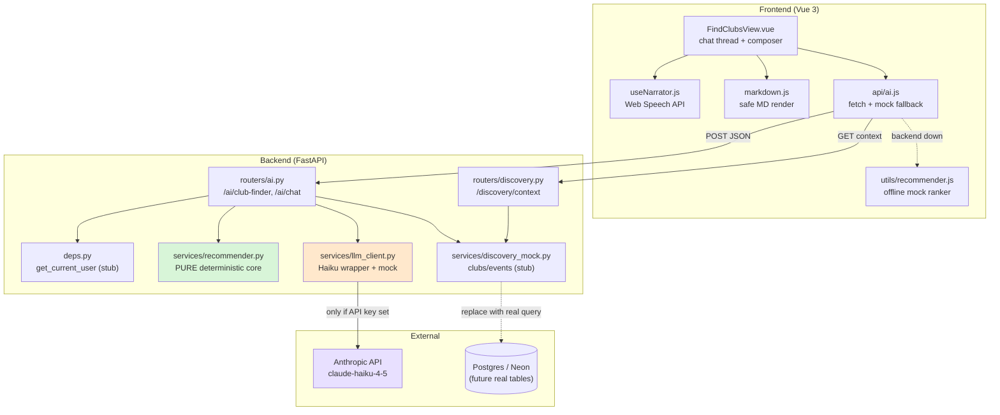
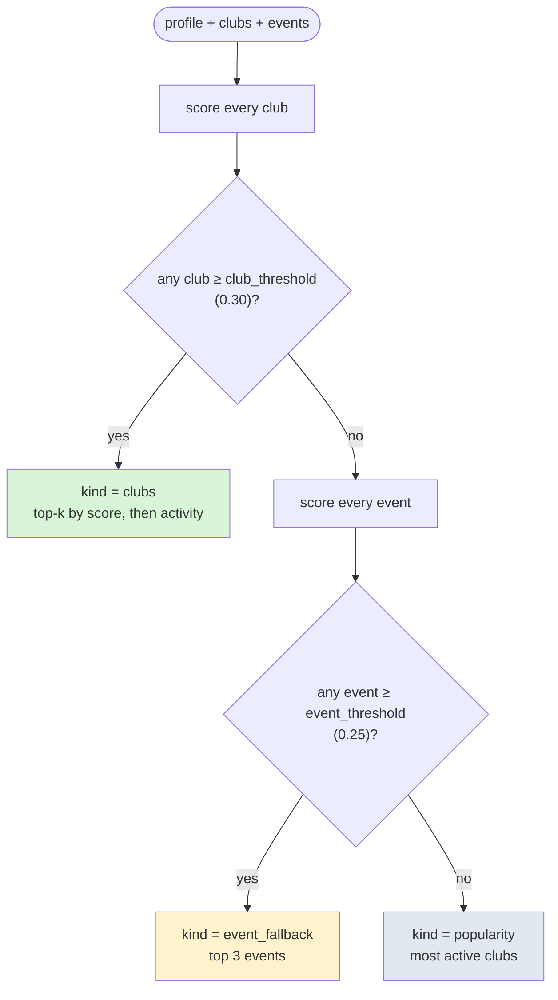
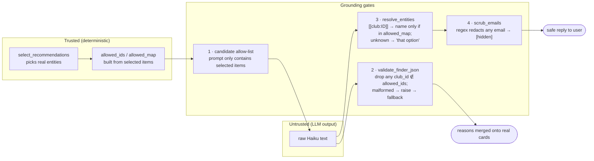
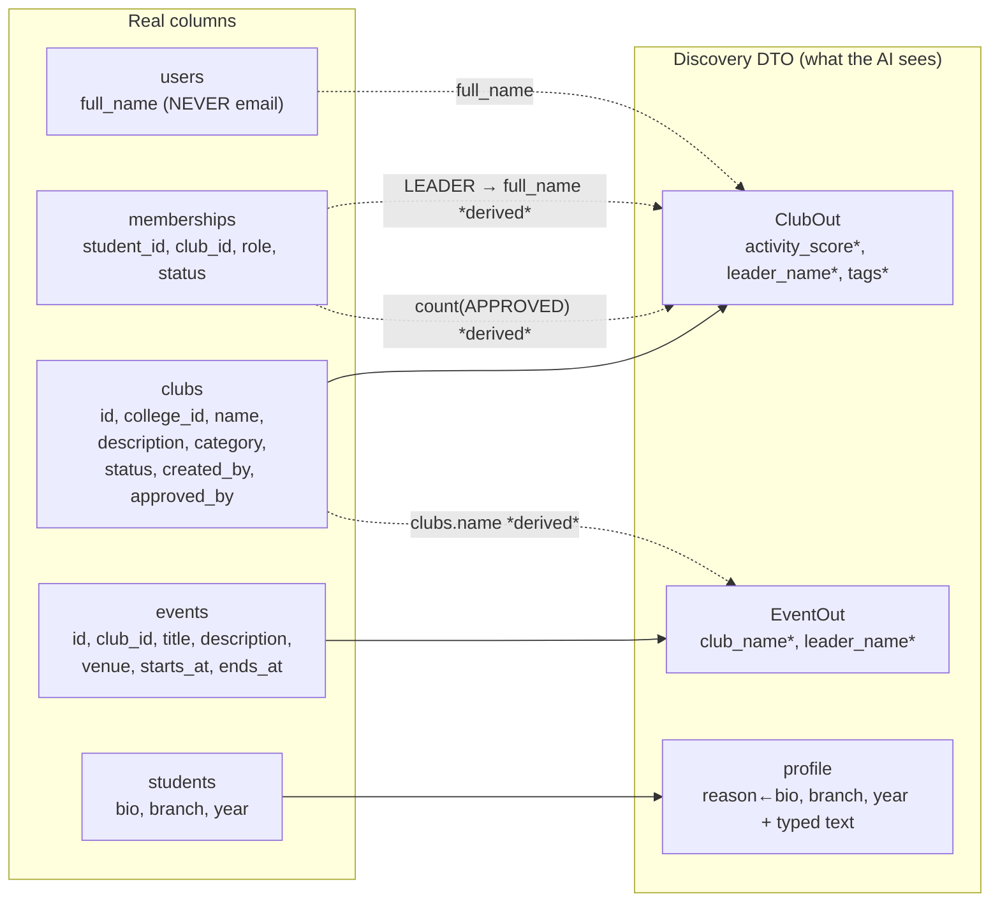
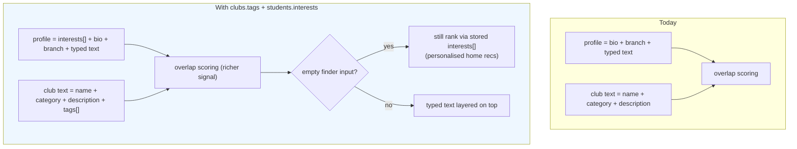
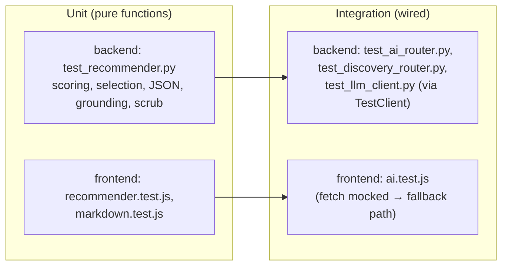

# Campus Connect — AI Club & Event Recommender

> Story 6.1 (single-shot finder) + Story 6.3 (conversational assistant)
> Model: **Claude Haiku** (`claude-haiku-4-5-20251001`) · Retrieval: none (in-context) · Recommender: content overlap + popularity prior

This document explains the AI module end to end: what it does, how it is
architected, how a request flows through it, how we keep the LLM **grounded**
so it can never invent data, the AI/LLM design choices, how it maps onto the
real database schema (now and if our requested additions land), and the full
testing story with real input/expected/actual results.

---

## 1. What it does and who it helps

The **AI Club Finder** lets a student describe their interests in plain
language ("I love building robots and electronics") and get back a small,
ranked set of clubs — or, when no club fits, relevant **events**, or the most
active clubs on campus. The assistant replies conversationally, reads its
answer aloud on request, and offers one-tap follow-ups to keep the
conversation going.

| Stakeholder | Benefit |
|---|---|
| **Students** | Discover niche clubs that have no social-media presence; natural-language search instead of hunting through a directory; honest answers ("nothing matches, but…") instead of dead ends. |
| **Club leaders** | Surfaces small/new clubs on equal footing (matching is on content, not follower counts), so niche clubs get discovered. |
| **Institute / client** | Higher club participation and event turnout; a defensible, privacy-safe AI feature (no email leakage, no hallucinated entities) that degrades gracefully to a deterministic ranking if the LLM is unavailable. |

---

## 2. Core principle

> **The deterministic core decides *what* to show. The LLM only decides *how
> to phrase it*.** The LLM never chooses which clubs exist and can never
> surface an entity it wasn't handed. If the LLM fails, callers fall back to
> the deterministic ranking and the feature still works.

```
fetch → cache → deterministicScore → select → buildPrompt → callHaiku → validate+resolve → merge
```

Only `callHaiku` touches the network / API key, and it lives **only** on the
backend.

---

## 3. Architecture



### File map

| Layer | File | Responsibility |
|---|---|---|
| Backend core | `app/services/recommender.py` | **Pure, deterministic**: tokenise, score, select, validate LLM JSON, resolve entities, scrub emails, build prompts. No network, no DB, no email. |
| Backend LLM | `app/services/llm_client.py` | Haiku wrapper. Real call when `ANTHROPIC_API_KEY` set; deterministic **mock** otherwise. Response cache. |
| Backend data | `app/services/discovery_mock.py` | Stand-in for the clubs/events query, shaped to the real schema. |
| Backend API | `app/routers/ai.py` | `/ai/club-finder`, `/ai/chat`. Orchestrates the pipeline. |
| Backend API | `app/routers/discovery.py` | `/discovery/context` — approved clubs + upcoming events, no email. |
| Backend auth | `app/deps.py` | `get_current_user()` stub until real auth exists. |
| Backend DTO | `app/schemas/ai.py`, `app/schemas/discovery.py` | Pydantic contracts (no email fields, ever). |
| Frontend | `views/FindClubsView.vue` | Chat thread, session history, follow-up chips, narrator button. |
| Frontend | `utils/recommender.js` | Offline mock ranker (used only when the backend is unreachable). |
| Frontend | `utils/markdown.js` | Safe, dependency-free Markdown → HTML (XSS-escaped). |
| Frontend | `composables/useNarrator.js` | Browser text-to-speech (play/pause/resume). |
| Frontend | `api/ai.js` | `fetch` the backend; normalise fields; fall back to the mock ranker. |

---

## 4. Pipeline flow — the finder

```mermaid
sequenceDiagram
    autonumber
    participant U as Student
    participant V as FindClubsView
    participant A as api/ai.js
    participant R as /ai/club-finder
    participant Rec as recommender (pure)
    participant H as llm_client → Haiku

    U->>V: types "painting and sketching"
    V->>A: findMatchingClubs(text)
    A->>R: POST { interest_text }
    R->>R: profile = stub + typed text
    R->>Rec: select_recommendations(profile, clubs, events)
    Rec-->>R: { kind, items }  (deterministic ranking)

    alt kind == clubs AND text present
        R->>Rec: build_finder_prompt(top≤3)
        R->>H: call_finder(prompt, candidate_hash)
        H-->>R: strict JSON [{club_id, reason}]
        R->>Rec: validate_finder_json(raw, allowed_ids)
        Note over R,Rec: hallucinated ids dropped;<br/>malformed → deterministic reason
    end

    R->>Rec: build_conversational_message_prompt(kind, items, remaining)
    R->>H: call_message(prompt)
    H-->>R: warm reply + follow-up question (Markdown)
    R-->>A: { kind, items(≤3), message }
    A->>A: normalise (banner, members, date parts)
    A-->>V: result
    V->>V: append turn, persist to sessionStorage
    V-->>U: cards + Markdown reply + Listen + follow-up chips
```

### Selection logic (deterministic core)



**Scoring formula** (per club), all terms in `[0,1]`:

```
score = 0.55·interest_overlap    (fraction of student tokens the club text matches)
      + 0.20·category_hit        (interest keyword → club category, e.g. "coding"→technology)
      + 0.10·branch_match        (student branch → category, e.g. cse→technology)
      + 0.15·popularity          (activity_score / max_activity)
```

`interest_overlap = |student_tokens ∩ club_tokens| / |student_tokens|`. Tokens
are lowercased alphanumerics, minus a small stopword set, length > 2.

---

## 5. Grounding — how the LLM is prevented from inventing data

This is the safety heart of the module. There are **four gates**, and the LLM
sits *inside* them, never at the edge.



| Gate | Mechanism | Failure behaviour |
|---|---|---|
| **1. Candidate allow-list** | The finder prompt lists *only* the ≤3 already-selected clubs; the chat system prompt lists only the college's real clubs/events, each tagged `[[club:ID]]`. | The model has nothing else to reference. |
| **2. JSON validation** | `validate_finder_json` parses strict JSON, **drops any `club_id` not in `allowed_ids`**, dedupes, truncates reasons. `json.loads` on prose raises. | On raise, the endpoint uses the deterministic reason ("Matches your interests."). |
| **3. Entity resolution** | Chat replies must reference entities as `[[club:ID]]`/`[[event:ID]]`; `resolve_entities` swaps them for real names **only if the id is in `allowed_map`**, else `"that option"`. | Hallucinated ids never reach the user. |
| **4. Email scrub** | `scrub_emails` regex-redacts anything email-shaped to `[hidden]`. DTOs also never carry an email field. | Defence in depth even if a leader name were an email. |

**Net guarantee:** the user can only ever see clubs/events that the
deterministic core selected from the database, phrased nicely — never an
invented one, never an email.

---

## 6. LLM / AI design

| Decision | Value | Why |
|---|---|---|
| Model | `claude-haiku-4-5-20251001` | Cheapest, fastest Claude tier; the task is short phrasing over a tiny candidate set, so a small model is ideal. |
| Finder temperature | `0.0` | Reasons should be deterministic and cacheable. |
| Chat / message temperature | `0.3` / `0.4` | A little warmth without drifting off-grounding. |
| `max_tokens` | 150 (finder), 200 (chat), 120 (message) | Answers are 2–3 sentences; small caps bound cost and latency. |
| Retrieval | **None** (in-context) | The candidate set is ≤ a few dozen clubs per college — it fits in the prompt. No RAG/vector store needed for correctness. |
| Caching | SHA-256 of `(prompt, candidate_hash)` | Identical requests skip the network entirely. |
| Mock fallback | Deterministic mock when no `ANTHROPIC_API_KEY` | Feature + tests run offline, free, and deterministically. |
| Key handling | `backend/.env` (gitignored), read via `python-dotenv`; explicit path resolution | Never hardcoded, logged, or returned in a response. |

**Cost posture:** small prompts, tiny token caps, temperature 0 + caching for
the finder, and the LLM is **skipped entirely** on empty interest text or when
the deterministic path returns event/popularity results without needing
phrasing. At Haiku rates each call is a fraction of a cent.

> Note: the schema provisions an `events.embedding vector` (pgvector) column.
> This module deliberately uses keyword overlap, not embeddings — sufficient
> and explainable for the current catalogue size. Semantic matching is a
> future upgrade path, not a current dependency.

---

## 7. Schema compliance (current)

The module was reconciled against the **final schema**
(`campus_connect_schema.md`). Several plan-era columns do **not** exist; the
module works within what the schema actually provides.



`*` = **derived at query time**, not a stored column.

| Plan assumed | Reality | Handling |
|---|---|---|
| `events.visibility` (public/members) | **Absent** — no public/private concept | Removed everywhere; the discovery layer already scopes to discoverable events. |
| `students.interests/hobbies/reason` | **Absent** — only `bio`, `branch`, `year` | Interest signal = typed `interest_text` + `bio`. |
| `clubs.activity_score` | **Absent** | Derived from APPROVED membership count. |
| `clubs.tags` | **Absent** (optional in plan) | Optional; matching falls back to category + description. |
| `leader_name` | Not a column | Derived: LEADER membership (or `created_by`) → `users.full_name`. |

Everything above is a **mock/stub today** (`discovery_mock.py`, `deps.py`)
returning schema-shaped dicts, so swapping in the real query later touches only
those two files.

---

## 8. Future — if the requested schema additions are accepted

We are requesting two small, non-blocking additions:

1. `clubs.tags TEXT[]` — sharper matching than description alone.
2. `students.interests TEXT[]` — a persistent interest profile.

With these, the finder gains a **"recommend without typing"** path and higher
match precision. The pipeline changes only at the edges (data in), not the
grounding core:



**Code impact** (small, localised):
- `deps.py` → return real `interests` from the student row (already the shape
  `_user_profile_dict` accepts).
- `discovery_mock.py`/real query → include `tags` on `ClubOut` (already an
  optional field on the DTO).
- `recommender.py` → **no change**: `score_club` already reads `tags` and
  `profile_tokens` already reads `interests`. The functions were written
  forward-compatible on purpose.

So the day the columns land, this is a data-wiring change, not a redesign —
and the grounding gates (Section 5) are untouched.

---

## 9. Design decisions (and trade-offs)

| Decision | Rationale | Trade-off accepted |
|---|---|---|
| **Deterministic core + LLM phrasing** (not "ask the LLM to pick clubs") | Reproducible, testable, cannot hallucinate entities, works offline. | Ranking is keyword/priors-based, not semantic (mitigated by future embeddings). |
| **LLM only on the backend** | The API key never reaches the browser or the built `dist/`. | One extra network hop. |
| **Mock fallback baked into `llm_client`** | Tests and local dev need no key, no network, no cost, and stay deterministic. | The mock's phrasing is generic (only used without a key). |
| **≤3 results + follow-up chips** | Avoids dumping the whole list; conversational, mobile-friendly. | Extra turns to see more (intentional). |
| **In-context, no RAG** | Catalogue is small per college; simpler, cheaper, explainable. | Won't scale to thousands of clubs without embeddings. |
| **Session-scoped chat history** (`sessionStorage`) | Conversation survives navigation without a backend/DB write. | Cleared when the tab closes (by design). |
| **Browser-native narrator** (Web Speech API) | Zero cost, no network, no extra dependency. | Voice quality varies by browser/OS. |
| **Frontend keeps a mock ranker** | UI degrades gracefully when the backend 404s/500s. | Two ranker implementations to keep roughly in sync (frontend one is simpler). |

---

## 10. Testing

### 10.1 Test requirements

The AI module must be verifiably:
1. **Correct** — scoring/selection behave as specified (thresholds, tie-breaks, bounds, determinism).
2. **Grounded** — hallucinated ids dropped; unknown chat entities never surfaced.
3. **Private** — no email ever leaves any endpoint.
4. **Robust** — malformed LLM output and LLM failure fall back cleanly.
5. **Schema-compliant** — DTOs expose only real/derived fields; no `visibility`.
6. **Offline & deterministic in CI** — tests never hit the network or need a key.

### 10.2 Test design & layering



- **Determinism guarantee:** `backend/tests/conftest.py` has an autouse fixture
  that pins `llm_client._API_KEY = ""` for every test, so the whole suite runs
  in **mock mode** regardless of `.env` — fast, free, offline. The real key is
  used only by the running dev server.

### 10.3 Unit tests — inputs, expected, actual

**Backend `test_recommender.py`** (pure core):

| Test | Input | Expected | Actual |
|---|---|---|---|
| stopwords/short tokens removed | `"I want to join a club for robotics"` | `{"robotics"}` | `{"robotics"}` ✅ |
| exact interest match scores high | interests `["robotics","drones"]` vs Robotics club | `score ≥ 0.5` | ✅ |
| no overlap below threshold | interests `["poetry"]` vs Robotics | `score < 0.30` | ✅ |
| deterministic | same inputs twice | equal scores | ✅ |
| score bounded | many overlapping tokens | `0 ≤ score ≤ 1` | ✅ |
| popularity breaks ties | two equal-text clubs, diff activity | higher-activity wins | ✅ |
| empty interests via branch/pop | interests `[]`, branch `cse` | `score > 0` | ✅ |
| event interest match | interests `["astronomy","stargazing"]` | `score ≥ 0.25` | ✅ |
| clubs first when match | `["robotics"]`, [Robo, Poet] | `kind=clubs`, id 1 first | ✅ |
| event fallback when no club | `["astronomy","stargazing"]`, [Poet], [AstroEvent] | `kind=event_fallback`, "organiser" in msg | ✅ |
| event fallback no email | leader `"Asha"` | `"@" not in message` | ✅ |
| irrelevant event not surfaced | interests vs unrelated event | `kind=popularity` | ✅ |
| popularity when nothing matches | `["knitting"]` | `kind=popularity`, highest activity first | ✅ |
| finder JSON: valid array | `[{"club_id":1,...}]` | parsed as-is | ✅ |
| finder JSON: strips fences | ```` ```json…``` ```` | parsed, id 2 | ✅ |
| finder JSON: drops hallucinated id | `[{99},{1}]`, allowed `{1,2,3}` | `[1]` only | ✅ |
| finder JSON: malformed raises | `"Sure! here you go"` | raises | ✅ |
| finder JSON: empty array | `"[]"` | `[]` | ✅ |
| finder JSON: dedupes | two `club_id:1` | length 1 | ✅ |
| chat: known entity resolved | `"Try [[club:1]] today"` | `"Try Robotics Club today"` | ✅ |
| chat: unknown entity not surfaced | `"[[club:77]]"` | `"77"` absent, `"that option"` present | ✅ |
| chat: plain text passthrough | no tags | unchanged | ✅ |
| chat: email scrubbed | `"lead@knit.ac.in"` | `"@"` removed | ✅ |

**Frontend `recommender.test.js`** (12) — tokenisation, `scoreClub`
(match/no-match/deterministic/bounds/tie-break), `scoreEvent`, and
`selectRecommendations` (clubs-first / event fallback / past-event ignored /
popularity). **`markdown.test.js`** (6) — bold, italics, **HTML escaped so no
injection**, paragraph splitting, empty input, and `stripMarkdown` for the
narrator. All ✅.

### 10.4 Integration tests — inputs, expected, actual

**Backend `test_ai_router.py`** (via FastAPI `TestClient`):

| Test | Input | Expected | Actual |
|---|---|---|---|
| clubs for matching interest | `{"interest_text":"robotics and drones"}` | 200, `kind=clubs`, item has `reason` | ✅ |
| skips LLM on empty text | `{"interest_text":""}` (mock `call_finder`) | `call_finder` **not called** | ✅ |
| deterministic reason on LLM fail | `call_finder` raises | reason == `"Matches your interests."` | ✅ |
| popularity for unmatched | `"underwater basket weaving"` | `kind=popularity` | ✅ |
| event fallback derived fields | patched context: no club match, 1 event | `kind=event_fallback`, `club_name`/`leader_name` present, no `@` | ✅ |
| no email in payload | `"robotics"` | `"@"` absent from body | ✅ |
| chat: no raw entity tag leaks | `"hi"` | `"[["` absent from reply | ✅ |
| chat: no email in reply | `"hi"` | `"@"` absent | ✅ |

**Backend `test_discovery_router.py`:** returns clubs+events (200); club keys
exactly `{id,name,category,description,activity_score,leader_name,tags}`; event
keys exactly `{id,club_id,title,description,venue,starts_at,club_name,leader_name}`
with **no `visibility`**; no `"@"` anywhere. All ✅.

**Backend `test_llm_client.py`:** mock `call_finder` returns JSON for every
candidate in the prompt; identical `(prompt, hash)` is cached; mock `call_chat`
references a club from the AVAILABLE block; graceful line when nothing
available. All ✅.

**Frontend `ai.test.js`:** `fetch` mocked to reject → `findMatchingClubs`
falls back to the local mock ranker → returns matched clubs / popularity, and
never includes an `@`. All ✅.

### 10.5 Actual run output

```
backend:   uv run pytest -q
           39 passed, 1 warning in 0.61s

frontend:  npx vitest run src/utils src/api      (AI-module suites)
           Test Files  3 passed (3)
           Tests      21 passed (21)
```

Every backend test (39) and every AI-module frontend test (21) passes, offline
and deterministically. (Two unrelated pre-existing failures elsewhere in the
frontend suite — a route-count assertion and an auth-localStorage test — are
not part of this module.)

### 10.6 How to run

```bash
# Backend (from backend/)
uv sync --group dev
uv run pytest -q            # or -v for per-test names

# Frontend (from frontend/)
npm run test                # full suite
npx vitest run src/utils src/api   # AI module only
```

---

## 11. Summary

The module pairs a **pure, deterministic recommender** with a **tightly
grounded LLM** that only ever phrases what the core already chose. Four
grounding gates make hallucinated entities and email leaks structurally
impossible; a mock LLM path keeps everything testable offline; and the whole
thing degrades to a plain ranking if the model or backend is unavailable. It
is schema-compliant today and forward-compatible with the two requested
column additions — which, when accepted, unlock personalised recommendations
without changing a single grounding guarantee.
