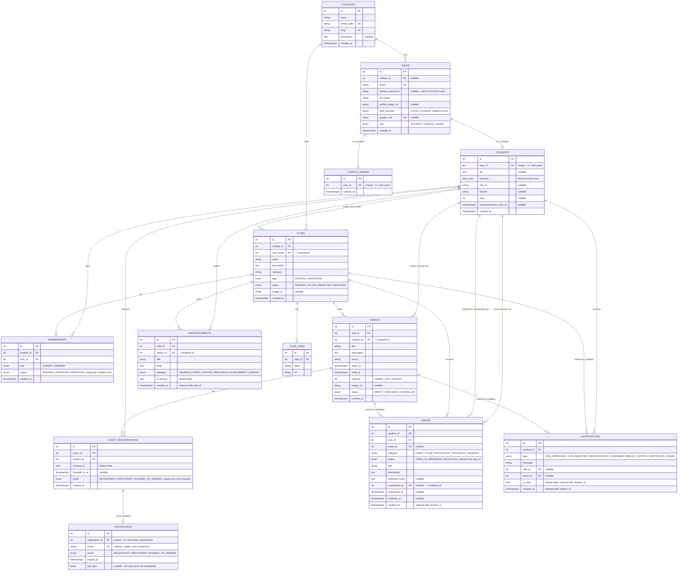

# Campus Connect - Full ERD (deployed backend, 13 tables)

Generated directly from `backend/app/models/*.py` (SQLAlchemy ORM source of truth), not from
memory - every column, type, FK, and unique/index constraint below matches the model files as of
2026-08-21.

## Notes worth knowing before using this

- **`USERS` is the identity root, not `STUDENTS`.** Every login is a `User` row; `role` decides
  whether it also has a `Student` row (`role=STUDENT`) or a `CampusAdmin` row
  (`role=CAMPUS_ADMIN`) - modeled as two independent nullable 1:1 relationships off `User`, not a
  single-table-inheritance or a discriminator FK. A `User` never has both.
- **Multi-tenancy runs through `college_id`.** `Users.college_id` is nullable (a not-yet-onboarded
  account can exist without one) but `Clubs.college_id` is required - every club belongs to
  exactly one college, and nearly every query elsewhere (club list, event list, the AI module's
  tools) scopes through this chain.
- **`Club.club_head` and `Event.created_by` both point at `students.id`, not `users.id`.** Club
  leadership and event authorship are membership-layer concepts, not identity-layer ones - a
  `CampusAdmin` cannot lead a club or create an event by construction, since they have no
  `Student` row to point at.
- **`Issue` has two FKs into the same table** (`student_id` the reporter, `responded_by` the
  responder, both `-> students.id`) - SQLAlchemy needs the `foreign_keys=[...]` disambiguation
  seen in the model for this, which is why it's called out explicitly above.
- **`EventRegistration` -> `Certificate` is 1:1 and nullable**, not 1:many - a registration earns
  at most one certificate, created only once `result` moves off `REGISTRANT` (see the AI-module
  session report, §1's "Set Results" bug, for exactly how that transition is gated).
- **Three tables carry explicit composite indexes/uniques worth knowing about your own queries
  against:** `Membership(student_id, club_id)` unique (can't join a club twice), `EventRegistration
  (event_id, student_id)` unique (can't double-register), and hand-added covering indexes on
  `Announcement(club_id, created_at)`, `Issue(club_id, status)` / `Issue(student_id, created_at)`,
  and `Notification(student_id, is_read)` / `Notification(student_id, created_at)` - these exist
  because those are the exact access patterns the feed/queue/badge queries actually run.
- **This ERD only reflects `app/models/`.** The AI module's durable memory
  (`backend/app/agent/memory.py`) deliberately lives outside this schema as a JSON file, not a
  14th table - see the session report's §5 for why that was a deliberate choice, not an omission
  here.
